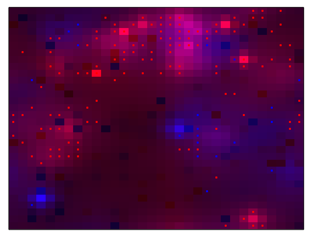

# ProbabilisticABM

This is a software library being developed and used as part of a research project into probabilistic [agent based modelling](https://en.wikipedia.org/wiki/Agent-based_model).

Although agent based models have had many applications, there are very few tools available to treat them probabilistically; making it hard to properly calibrate models, assimilate observational data into models and quantify uncertainty in model results.

This project adapts the mathematical tools of quantum field theory to allow us to do Bayesian inference on agent based models, with the ultimate goal of being able to simulate social systems using real-world data to calibrate and constrain the state of the system while providing a proper treatment of uncertainty in the model results.

An introduction to our approach can be found in [/doc/mathsFoundataions.pdf](https://github.com/deselby-research/ProbabilisticABM/blob/master/doc/mathsFoundations.pdf)

### Dependencies

This library makes use of the following standard libraries, available on Maven, so please make sure they are installed on your system:
* `junit:junit:4.12`
* `org.apache.commons:commons-exec:1.3`
* `org.apache.commons:commons-math3:3.6.1`
* `org.jetbrains.kotlinx:kotlinx-coroutines-core:1.3.0`

### Data assimilation

[/doc/ABMDataAssimilation.pdf](https://github.com/deselby-research/ProbabilisticABM/blob/master/doc/ABMDataAssimilation.pdf) describes how we used this software to perform assimilation of incomplete, noisy observations into a spatial predator-prey model. The code used to create the results in this paper can be found in the `src/experiments/spatialPredatorPrey/fock` directory. 

